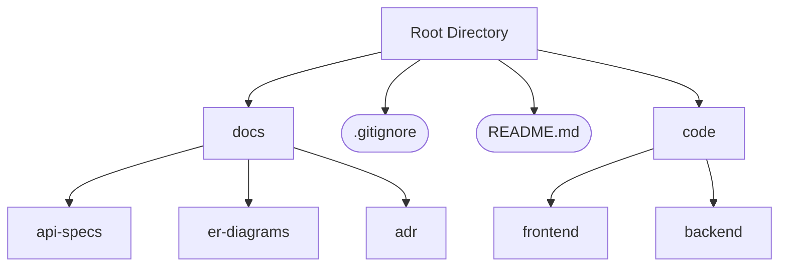

# Quiz App Project Repository

This repository is structured to separate different aspects of the project for clarity and ease of use. Below is a visualization of the directory structure along with brief explanations of each folder and file.

## Repository Structure

## Folder and File Breakdown

- **docs/**
  - This folder contains all documentation related to the project.
    - **api-specs/**: API specifications and related documentation files.
    - **er-diagrams/**: Entity-Relationship diagrams for database design.
    - **adr/**: Architecture Decision Records, documenting important architectural choices made during development.

- **code/**
  - This folder contains all code for both the frontend and backend of the project.
    - **frontend/**: All files related to frontend development.
    - **backend/**: All files related to backend development.

- **.gitignore**
  - Specifies files and directories that should be ignored by Git, ensuring that sensitive or unnecessary files are not pushed to the repository.

- **README.md**
  - This file, providing an overview of the repository's structure and contents.

## Git Feature Branch Workflow

In this repository, we follow the **Feature Branch Workflow** to ensure that new features, bug fixes, and improvements are developed in isolation before they are integrated into the main codebase. Below is an overview of how the workflow operates:

### Diagram

The following diagram illustrates the Git Feature Branch Workflow:

## How to Use

1. Navigate through the `docs/` folder for important project documentation such as API specs, ER diagrams, and architecture decisions.
2. Explore the `code/` folder to view and work on the project’s frontend and backend code.
3. Refer to the `.gitignore` file to understand what files are ignored from version control.
